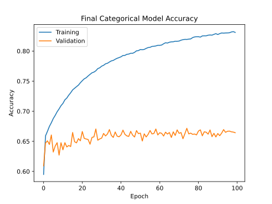
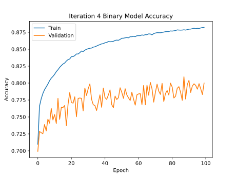
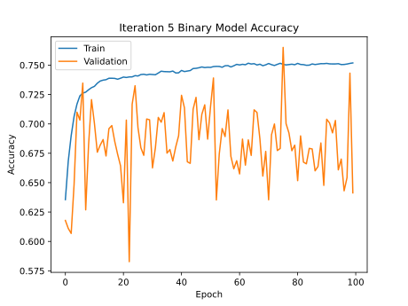

# Project-4

# Table of Contents

1. [Overview](#overview)
2. [Dataset](#dataset)
    1. [Description](#description)
    2. [Limitations](#limitations)
3. [Data Preprocessing](#data-preprocessing)
4. [Models](#models)
    1. [Unsupervised (K-means)](#unsupervised-k-means)
    2. [Supervised (Neural Networks)](#supervised-neural-networks)
        1. [Popularity Prediction](#popularity-prediction)
        2. [Genre Prediction](#genre-prediction)
5. [Summary](#summary)

# Overview

the aim of our project is to group songs by their characteristics in order to create a song recommendation program. We also tried to predict the popularity and genre of songs based on their characteristics. We used K-means to cluster the songs by their characteristics, and neural networks to predict their popularity and genre. 

# Dataset

## Description

This project is based on a [Spotify dataset](https://www.kaggle.com/datasets/maharshipandya/-spotify-tracks-dataset) that was downloaded from Kaggle. 

The included metrics and their values are as follows:
* Popularity - 0-100; This is a representation of the song's popularity
* Duration - Wide range of numbers; this describes the duration of the song in miliseconds (ms)
* Explicit - T/F; This describes whether the lyrics are explicit
* Danceability - 0-1; This describes how suitable a song is for dancing based on factors including tempo, beat strength, and overall regularity
* Energy - 0-1; This is a perceptual measure of energy and activity in the song
* Key - 0-11; This is the key 
* Loudness - ~-49-4; This is the overall loudness of the song, in decibels (dB)
* Mode - 0 or 1; This describes whether the song is in major or minor key - 0=minor key, 1=major key
* Speechiness - 0-1; Measure of how much spoken word is present in a song
* Acousticness - 0-1; A confidence measure of whether a song is acoustic
* Instrumentalness - 0-1; This is a prediction of whether a song has vocals
* Liveliness - 0-1; This is a prediction of whether the track was recorded live (the presence of an audience in the recording)
* Valence - 0-1; Describes how positive the music sounds
* Tempo - 0-243; Beats per minute (BPM)
* Time signature - 3-7; This represents time signatures from 3/4 - 7/4, with the value divided by 4 to obtain the time signature
* Track_genre - Genre; 114 genres are included

## Limitations

This dataset was downloaded from Kaggle, and consists of data collected using the [Spotify API](https://developer.spotify.com/documentation/web-api).

* The biggest limitation of this dataset is genre
    * Spotify does not track genre specifically for songs; it tracks genre for artists and albums
        * The genre data here was collected through API calls looking for each specific genre and recording what songs (with their characteristics) were returned
        * This means that some of the songs are duplicates that had to be filtered out
        * This also means that some of the songs should have multiple genres but do not in this dataset
* Another limitation is the size of the dataset. The data consists of ~1000 songs for each of the 114 genres, but some of thees are duplicates. There are over 100,000 songs in this dataset, but more could make the models more robust

# Data Preprocessing

**@Group - Please add any preprocessing you did for your models that were not done in my data cleaning notebook, and read over the data processing section in general! I have pointed out a few areas that need your input in particular below**

Each model used slightly different preprocessing, as detailed below. 
* Duplicate songs were removed
* Songs with a duration of <= 0 were removed
* The number of artists for each song was determined, and the number of artists was binned
    * This data was used only in the popularity prediction model
    * The bins made this data categorical, so it was later encoded
* Combined artists and track_name into one column to create a meaningful index for the K-Means model
* Track ID was removed
* Duration was converted to minutes
* Categorical data was encoded
    * Time signature and key were one-hot encoded
* All T/F data was converted to integer type (to ensure numerical data)
* Model-specific preprocessing:
    * Data was normalized
        * For the K-Means model: StandardScaler was applied to the selected features first and then PCA was later applied to the scaled features to improve the clusters
        * For the popularity prediction, StandardScaler and MinMaxScaler were tested, as well as MinMaxScaler only on the Loudness, Tempo, and Duration data (the only data that was not either binary or between 0 and 1)

        **@Group - Add your normalization methods here; the order should be Brenda, then Sarah, then Carly to keep consistent with the proposed ppt order (K-Means -> popularity -> genre)**

    * The data pertaining to the target variable for the supervised learning models was manipulated
        * For the popularity prediction, popularity was binned into 2, 3, or 4 segments and encoded using the to_categorical method for the 3 and 4 bin models
        * For the genre prediction, genre_track were encoded into numbers using genre_mapping and all columns were scaled using MinMax for values to be 0-1

    * Subsets of the data that were used
        * For the K-Means model: popularity, danceability, energy, loudness and temp were selected as features as features for the model
    * Subsets of the data were removed
        * For the popularity prediction the Artist, Album, and Track Name data was removed
    * Subsets of the data that were used
        * For the genre prediction: popularity, explicit, danceability, energy, loudness, mode, speechiness

        **@Group - Add any data you removed or kept here (whichever list is shorter); the order should be Brenda, then Sarah, then Carly to keep consistent with the proposed ppt order (K-Means -> popularity -> genre)**
    
    * Further data was encoded
        * For the popularity and genre model, genre was binary encoded

        **@Group - Add any extra data encoding you performed here, if any (if there is none, that's fine); the order should be Brenda, then Sarah, then Carly to keep consistent with the proposed ppt order (K-Means -> popularity -> genre)**

# Models

## Unsupervised (K-Means)

* From the original dataset, artists and track_name were combined into one column to become the index. Popularity, danceability, energy, loudness and temp were then identified as features of the songs to be used in this model.
* We then applied K-Means and PCA modeling to create the clusters in scatter plots.
    1. K-Means
       * Used inertia and k to create an elbow graph to determine appropiate number of clusters. This resulted in 4 clusters being used for this model.

 

    * The scaled features were then assigned to clusters and plotted on scatter plots. We set x = popularity to then compare popularity to the other features.
    * This did not show the data clusters very clearly in 2D as it appears that some of the clusters are on top of each other. A 3D model would probably better show how the clusters are formed. 

    2. PCA
     * We used the same number of compondents suggested in the above elbow curve for this model's clusters. 
     * We reached an explained variance ratio of 95.47%.
     * We then plotted x= PC1 and y= PC2 to achieve a more clear display of the clusters.

     * We were then able to view which songs were associated with each cluster. 

## Supervised (Neural Networks)

### Popularity Prediction

* We first tried converting popularity into categorical bins and predicting the bin based on song characteristics. The accuracy and loss are in the summary_stats folder. We tested several different preprocessing methods and then performed hyperparameter tuning to determine the best model structure once we settled on the preprocessing.
* We tried the iterations below:
1. Standard scaler with 4 popularity bins:
    * 0 = "None" = 0
    * 0 < popularity <= 30 = "Low" = 1
    * 30 < popularity <= 60 = "Medium" = 2
    * popularity > 60 = "High" = 3
2. Standard scaler with 3 popularity bins:
    * popularity <= 30 = "Low" = 0
    * 30 < popularity <= 60= "Medium" = 1
    * popularity > 60 = "High" = 2
    * The 3-bin model improves the accuracy and decreases the loss, so 3-bin was carried forward
3. Min-max scaler with 3 popularity bins
    * Both accuracy and loss improved; accuracy increased by ~1% and loss decreased by ~2%
    * MinMax scaling was carried forward
4. Random oversampling with 3 bins and MinMax scaling 
    * The data is very skewed toward unpopular (~12% 'popular' songs)
    * Oversampling was performed to reduce skew in the dataset
    * This decreased accuracy and increased loss
    * Still maintained this preprocessing step, because the data is very skewed and initial accuracy could almost be the result of calling every song unpopular
5. Normalization only on a subset of columns with oversampling, 3 bins, and MinMax scaling
    * Loudness, tempo, and duration were normalized
    * This decreased the accuracy very slightly and increased the loss slightly; moving forward the whole dataset was normalized
6. Hyperparamerter tuning was performed to determine the optimal number of hidden layers and nodes in each layer with popularity binned into 3 bins, min-max scaling, random oversampling, and normalization of the full dataset

    | Categorical Iteration | Loss  | Accuracy |
    | --------------------- | ----- | -------- |
    | 1                     | 0.835 | 0.663    |
    | 2                     | 0.693 | 0.704    |
    | 3                     | 0.681 | 0.705    |
    | 4                     | 0.78  | 0.663    |
    | 5                     | 0.776 | 0.669    |
    | 6                     | 1.154 | 0.664    |

* Overall, this categorical model did not work well, with a maximum accuracy of only ~66% after the addition of random oversampling to reduce skew in the dataset

* Since decreasing the number of bins from 4 to 3 increased the accuracy significantly, we also tried converting popularity into a binary:
    * < 60 popularity = Unpopular = 0
    * \> 60 popularity = Popular = 1
* With these binary bins, we tested similar iterations to those described above.
1. StandardScaler normalization
2. MinMaxScaler
    * Accuracy increased slightly while loss decreased slightly
    * We switched to MinMax scaling for normalization
3. Random oversampling with MinMax scaling
    * The data is very skewed toward unpopular
    * Added random oversampling to account for the skew 
    * Accuracy decreased
    * Still maintained random oversampling, because the data is very skewed and initial accuracy could almost be the result of calling everything unpopular
4. Normalization only on subset of columns with otherwise the same preprocessing as iteration 4
    * Loudness, tempo, and duration were normalized
    * This increased the model accuracy
    * Upon visualization of the training and testing accuracy throughout training, we noticed that the testing accuracy was significantly lower than the training accuracy
        * We wondered if this was due to a problem of overfitting to the training data

    

5. Model optimization to reduce overfitting
    * The number of nodes in the hidden layers of the model were decreased and a regularizer was added to see whether this could reduce overfitting and increase the testing accuracy
    * This decreased the overall accuracy, though it did move the testing accuracy closer to the training accuracy
    * The regularizer was omitted for the final hyperparameter tuning

6. Hyperparameter tuning was performed to determine the optimal number of hidden layers and nodes in each layer with min-max scaling, random oversampling, and normalization of only loudness, tempo, and duration 
    * This increases the accuracy as much as possible with the addition of oversampling
    

    | Binary Iteration | Loss  | Accuracy |
    | ---------------- | ----- | -------- |
    | 1                | 0.345 | 0.876    |
    | 2                | 0.319 | 0.868    |
    | 3                | 0.544 | 0.793    |
    | 4                | 0.513 | 0.8      |
    | 5                | 0.626 | 0.641    |
    | 6                | 0.818 | 0.834    |

### Genre Prediction

* We first tried binning the genre_tracks into 6 different bins based on their alphabetical order, but that did nto give us the outcome of a specific genre a song would be predicted to have beased on the popularity, explicit, danceability, energy, loudness, mode, speechiness characertsitics. The accuracy and loss are in Genre_Model folder under the file 4 Making predictions. We tested several different preprocessing methods such as logistic regression and neural networks to see which will accruately predict the genre better.
* We tried the iterations below:
    1. Binning Genre_track into 6 bins:
        * Bin 1: acoustic, afrobeat, alt-rock, alternative, ambient, anime, black-metal, bluegrass, blues, brazil, breakbeat, british, cantopop, chicago-house, children, chill, classical, club, and comedy
        * Bin 2: country, dance, dancehall, death-metal, deep-house, detroit-techno, disco, disney, drum-and-bass, dub, dubstep, edm, electro, electronic, emo, folk, forro, french, and funk
        * Bin 3: garage, german, gospel, goth, grindcore, groove, grunge, guitar, happy, hard-rock, hardcore, hardstyle, heavy-metal, hip-hop, honky-tonk, house, idm, indian, and indie-pop
        * Bin 4: indie, industrial, iranian, j-dance, j-idol, j-pop, j-rock, jazz, k-pop, kids, latin, latino, malay, mandopop, metal, metalcore, minimal-techno, mpb, and new-age
        * Bin 5: opera, pagode, party,piano, pop-film, pop, power-pop, progressive-house, psych-rock, punk-rock, punk, r-n-b, reggae, reggaeton, rock-n-roll, rock, rockabilly, romance, and sad
        * Bin 6: salsa, samba, sertanejo, show-tunes, singer-songwriter, ska, sleep, songwriter, soul, spanish, study, swedish, synth-pop, tango, techno, trance, trip-hop, turkish, world-music,
    2. Genre encoder using genre_mapping:
        * acoustic,0
        * afrobeat,1
        * alt-rock,2
        * alternative,3
        * ambient,4
        * anime,5
        * black-metal,6
        * bluegrass,7
        * ...
        * synth-pop,107
        * tango,108
        * techno,109
        * trance,110
        * trip-hop,111
        * turkish,112
        * world-music,113
    3. Min-max scaler for 
        * popularity
        * loudness
    4. Changed binned genres to individual mapped out genre
        * Genre_mapping.csv shows the genres encoded with numbers from 0-113
        * 
    5. 30 columns of characteristics were used 
        * 
        * This includes: popularity, explicit, danceability, energy, loudness, mode, speechiness, acousticness, instrumentalness, liveness, valence, tempo, duration_min, time_signature_0, time_signature_1, time_signature_3,     time_signature_4, time_signature_5, key_0,key_1,key_2,key_3,key_4,key_5,key_6,key_7,key_8,key_9,key_10,key_11

* With the encoded genre_track, we tested these iterations
    1. Whether it was multiclass or multilabel
    2. Training the neural network model with mutiple layers using "Dense" as iterations of 50, 100, 200, and 300
    3. Increasing the Epoch which slowed the learning, but improved the accuracy
    
* Here is how the model works
    1. Training the model with 30 columns to find the one genre code
    
    
    2. Random generate the 30 different characteristics 
    

    3. The model will output a genre code which will be a number associated with a specific genre type
    4. 

* With the encoded genre_track, we tested these iterations
    1. Whether it was multiclass or multilabel
    2. Training the neural network model with mutiple layers using "Dense" as iterations of 50, 100, 200, and 300
    3. Increasing the Epoch which slowed the learning, but improved the accuracy

# Summary

In terms of the K-Means model, the PCA model was better able to create clusters using the selected features with a 95% explained variance ratio. It would be interesting to see what a 3D version of the K-means clusters would look like and if that would better show the clusters. While the PCA model shows 4 fairly distinct clusters, further examination of the songs within these clusters would need to be conducted to better understand how the songs in each cluster are connected. It would also be interesting to redue these models including Track_gene in the features or simply comparing popularity to Track_gene.

In terms of popularity predictions, a neural network model is able to predict the binary popular vs unpopular categories relatively well, with a final accuracy of ~83%. However, the model is significantly less accurate the more segments the popularity is split into, with accuracy of only 67% with four bins and 71% with three bins (before the addition of random oversampling, such that these accuracy scores may be too high). Random oversampling in all cases decreased the model accuracy. However only 12% of the songs were labeled with popularity > 60, so the higher accuracy may not be fully representative without the oversampling. Our attempt to compensate for any potential model overfitting through the use of regularizers did not work, so the model may be overfit to the training data. Overall while we were able to build a relatively accurate model to predict the popularity of a song based on its characteristics, this dataset does not support this prediction very well due to how skewed the dataset is toward 'unpopular' songs. This may be a problem with this specific dataset, that the inclusion of more songs may improve, or it may be a problem with Spotify's measure of popularity (perhaps popularity is very stringent, such that very few songs are actually marked as popular). 

In terms of the genre predictions, the model had difficulty predicting the specific genre_track depending on the charactersitics given (popularity, explicit, danceability, energy, loudness, mode, speechiness). We could of used bins for the 114 genres of songs, but it would not pinpoint the specific genre type it would most likel be. The model outputs a genre code that represents a singular genre type, but with 30% accuracy. We think that mutiple genre types could have similar characteristics so the machine learning model had difficulty outputting one specific genre. With more time, we would of probably grouped up some genres such as cantopop, indie-pop, j-pop, k-pop, pop, power-pop, and trip-hop which have similar song characteristics. 
